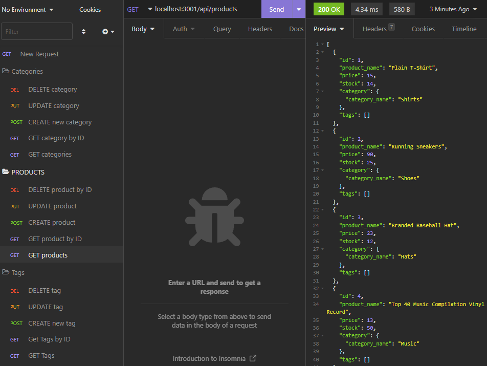

# E-Commerce Back End

  

  # Description
This is a back end challenge utilizing MySql's CRUD routes. This createse different categories, tags, and products based on one another. 

  # Installation
  The following necessary dependencies must be installed to run the application:

  npm install

    to download all dependencies within the package.json

  # Usage
  In order to use this app, you will need Visual Studio Code, Node.js, MySql, dotenv, mysql2, sequelize, and express.js. 
  You will need to run the 'npm run schema' to run the database and run 'npm run seed' to seed the database. Don't forget to create a .env file and include your username and password. 

  # Questions
  If you have any questions about the repository, please contact/email benny.le890@gmail.com  
  My GitHub profile is found at [GitHub Profile](https//GitHub.com/bennyle890)
